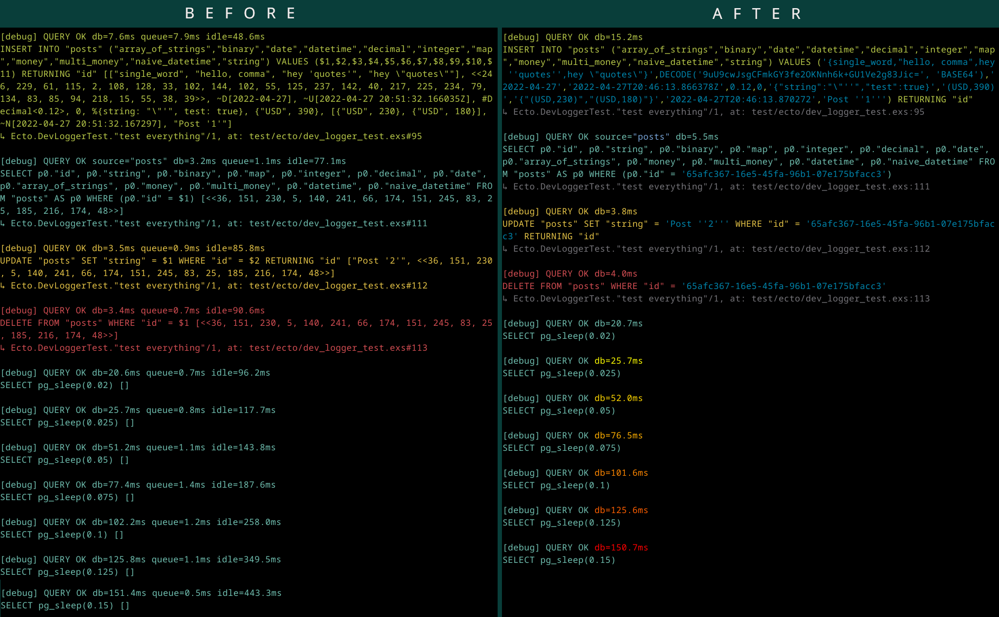

# Ecto.DevLogger

[](https://hex.pm/packages/ecto_dev_logger)

An alternative logger for Ecto queries.

It inlines bindings into the query, so it is easy to copy-paste logged SQL and run it in any IDE for debugging without
manual transformation of common elixir terms to string representation (binary UUID, DateTime, Decimal, json, etc).
Also, it highlights db time to make slow queries noticeable. Source table and inlined bindings are highlighted as well.




## Installation

The package can be installed by adding `ecto_dev_logger` to your list of dependencies in `mix.exs`:

```elixir
def deps do
  [
    {:ecto_dev_logger, "~> 0.7"}
  ]
end
```

Then disable default logger for your repo in config file for dev mode:
```elixir
if config_env() == :dev do
  config :my_app, MyApp.Repo, log: false
end
```
And install telemetry handler in `MyApp.Application`:
```elixir
Ecto.DevLogger.install(MyApp.Repo)
```
Telemetry handler will be installed only if `log` configuration value is set to `false`.

That's it.

The docs can be found at [https://hexdocs.pm/ecto_dev_logger](https://hexdocs.pm/ecto_dev_logger).

