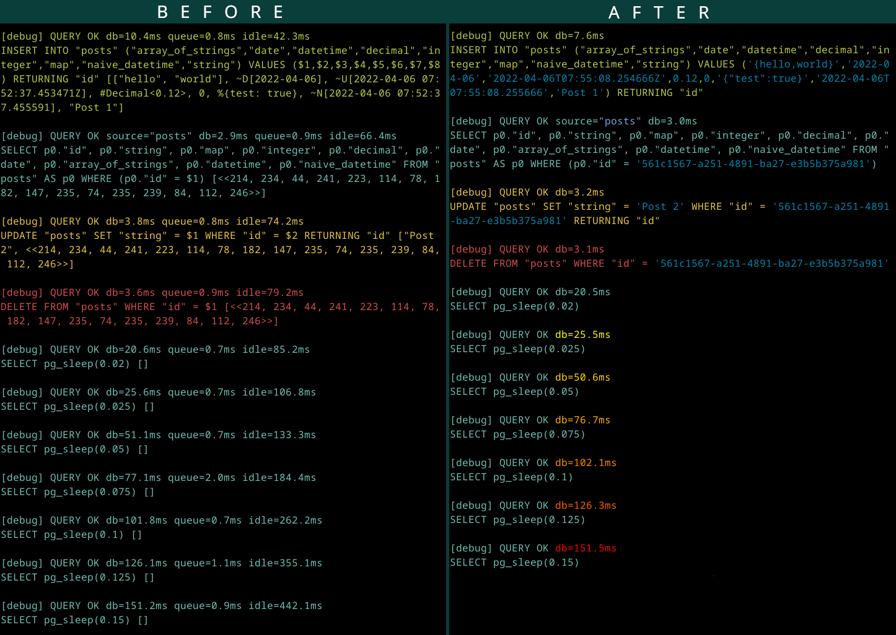

# Ecto.DevLogger

[](https://hex.pm/packages/ecto_dev_logger)

An alternative logger for Ecto queries.

It inlines bindings into the query, so it is easy to copy-paste logged SQL and run it in any IDE for debugging without
manual transformation of common elixir terms to string representation (binary UUID, DateTime, Decimal, json, etc).
Also, it highlights db time to make slow queries noticeable. Source table and inlined bindings are highlighted as well.




## Installation

The package can be installed by adding `ecto_dev_logger` to your list of dependencies in `mix.exs`:

```elixir
def deps do
  [
    {:ecto_dev_logger, "~> 0.10"}
  ]
end
```

Then disable default logger for your repo in config file for dev mode:
```elixir
if config_env() == :dev do
  config :my_app, MyApp.Repo, log: false
end
```
And install telemetry handler in `MyApp.Application`:
```elixir
Ecto.DevLogger.install(MyApp.Repo)
```
Telemetry handler will be installed *only* if `log` configuration value is set to `false`.

That's it.

The docs can be found at [https://hexdocs.pm/ecto_dev_logger](https://hexdocs.pm/ecto_dev_logger).

### Development Only Installation

If you turn off repo logging for any reason in production, you can configure `ecto_dev_logger` to *only* be available
in development. In your `mix.exs`, restrict the installation to `:dev`:

```elixir
def deps do
  [
    {:ecto_dev_logger, "~> 0.10", only: :dev}
  ]
end
```

In `MyApp.Application`, an additional function is required:

```elixir
defmodule MyApp.Application do
  @moduledoc "..."

  def start(_type, _args) do
    maybe_install_ecto_dev_logger()

    # ...
  end

  if Code.ensure_loaded?(Ecto.DevLogger) do
    defp maybe_install_ecto_dev_logger, do: Ecto.DevLogger.install(MyApp.Repo)
  else
    defp maybe_install_ecto_dev_logger, do: :ok
  end

  # ...
end
```

### Format queries

It is possible to format queries using a `:before_inline_callback` option.
Here is an example of setup using [pgFormatter](https://github.com/darold/pgFormatter) as an external utility:
```elixir
defmodule MyApp.Application do
  def start(_type, _args) do
    Ecto.DevLogger.install(MyApp.Repo, before_inline_callback: &__MODULE__.format_sql_query/1)
  end

  def format_sql_query(query) do
    case System.shell("echo $SQL_QUERY | pg_format -", env: [{"SQL_QUERY", query}], stderr_to_stdout: true) do
      {formatted_query, 0} -> String.trim_trailing(formatted_query)
      _ -> query
    end
  end
end
```
